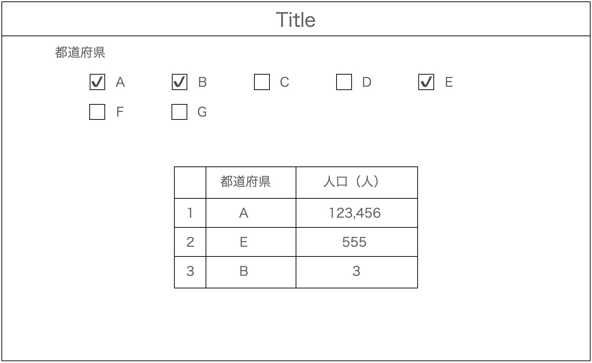

# 課題

**用意してある`db.json`のデータを元に、都道府県別(中部地方)の人口ランキングを表示するアプリを構築せよ**

## ワイヤーフレーム

## 内容

1. API レスポンスから都道府県一覧のチェックボックスを動的に生成する
1. 都道府県にチェックを入れると、選択された都道府県の人口ランキンが表示される
1. 「人口」の他に「面積」「人口密度」も切り替える UI を何らかの形で用意し表示できるようにすること（同時に表示する必要なない）

## 制約

- タスク分解を実施し、作業計画を立ててから作業すること
  - タスク分解例は後述を参考にすること
- 最新版の新規 Next.js プロジェクトで構築すること
- JSON Server を利用し、db.json は同フォルダに格納されているものを使用すること
  - `db.json`のデータは「都道府県名」「人口（人）」「面積（$km^{2}）$」である
- Google Chrome 最新版で正しく動くこと
- style は自分で記述し、UI フレームワークなどは原則使用しないこと
  - Tailwind CSS を利用する際は、通常の CSS でどのように記述されるか説明できるようにすること
- TypeScript で記述すること
- Component 化などで、ソースコードの可読性を意識すること
- ESLint, Prettier を導入し、コード保存時に Prettier の自動整形が効くようにすること
  - ESLint, Prettier の設定ファイルは同フォルダに格納されているファイルを使用すること
  - ESLint, Prettier 関連 package は以下を`$ npm i -D <package>`で Install すること
    - eslint-config-prettier
    - eslint-plugin-react-hooks
    - prettier
    - prettier-plugin-tailwindcss
    - @typescript-eslint/eslint-plugin
    - @typescript-eslint/parser
    - eslint (※おそらく Install 済)
    - eslint-config-next (※おそらく Install 済)
- VSCode で作業し、以下の拡張機能を導入すること
  - ESLint
  - Prettier
  - Tailwind CSS IntelliSense

## タスク分解例

- 環境構築
  - JSON Server (MM/dd 完了見込み)
  - NPM Pacakge (MM/dd 完了見込み)
- API の実装
  - 〇〇の GET 処理 (MM/dd 完了見込み)
- 表示系の実装
  - 〇〇用 Component (MM/dd 完了見込み)
  - 〇〇用 Component (MM/dd 完了見込み)
- 操作系の実装
  - 〇〇機能の実装 (MM/dd 完了見込み)
- レビュー指摘対応 (MM/dd 完了見込み)
